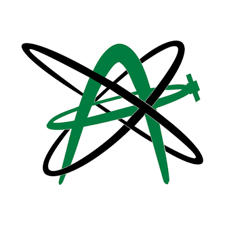

# Heyo, I'm Syed Reza
"you’re not behind — you’re just on your own timeline" 

    

## Projects

Check out some of my previous coding projects!

- 🧭 **[multi-agent navigation](https://github.com/reza-abdi/multi-agent-navigation)** - multi-agent reinforcement learning system using MAPPO and centralized training with decentralized execution
- 📈 **[rl-trading bot](https://github.com/reza-abdi/rl-trading-bot)** - Q-learning trading agent that makes buy, sell, and hold decisions using market indicators
- 📧 **[spam-emaildetection](https://github.com/reza-abdi/spam-emaildetection)** - NLP spam classifier using bag-of-words features and logistic regression
- 🚀 **[investra](https://github.com/reza-abdi/investra)** - AI-powered stock market dashboard with machine learning predictions, technical indicators, and interactive charts
- 🌿 **[Plantagotchi](https://github.com/reza-abdi/Plantagotchi)** - interactive React Native plant-care companion powered by real-time Arduino sensor data and WebSockets
- 🎰 **[jackpot](https://github.com/reza-abdi/jackpot)** - Android event lottery application built with Java, Firebase, maps, QR scanning, testing, and agile development
- 🧠 **[studywave](https://github.com/reza-abdi/studywave)** - EEG-based focus analysis system using a Muse headset, BrainFlow, and signal-processing techniques

Free free to reach out with any questions about my code or projects!

---

## My Github Stats ##
<!--

-->

--- 

## About Me ##

- 4th Year Computing Science | Honours student
- hackathon lover (NatHacks, HackEd, ...)
- You can find me on 

or at [syedreza@ualberta.ca](mailto:syedreza@ualberta.ca).

<!-- Icons -->

[1.2]: https://raw.githubusercontent.com/MartinHeinz/MartinHeinz/master/linkedin-3-16.png (linkedin image)

<!-- Links to your social media accounts -->

[1]: https://www.linkedin.com/in/syedreza-abdi/

<!--
---
## Technical Skills

-->

---

## Previously at:

  
  
  
  </a>
  
  

